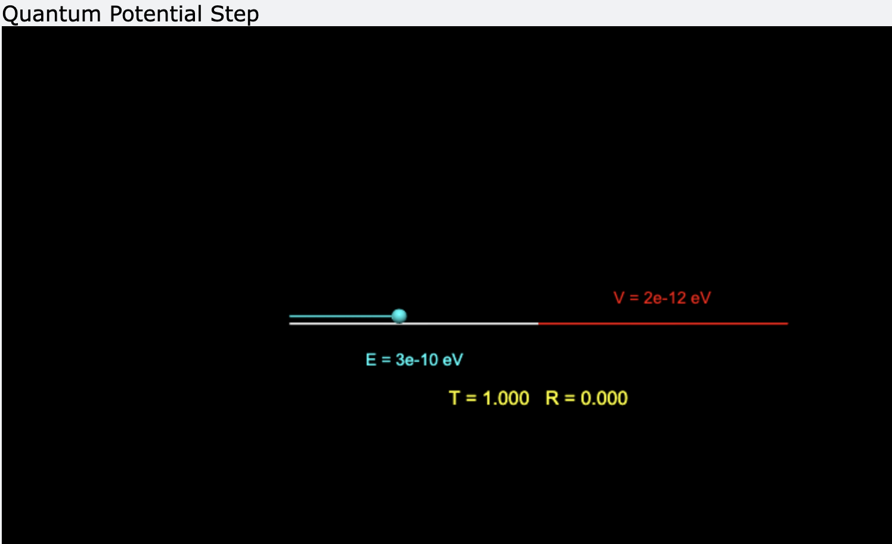

### Overview
- this is my solution for the exercise from "Computational Physics by Newman" (exercise 2.5), which deals with the quantum potentiak step, in 1D. I also visualised it in the same way as the book 

$$
T = \frac{3k_1k_2}{(k_1 + k_2)^2}
$$ 
$$
R = (\frac{k_1 - k_2}{k_1 + k_2})^2
$$

> this is a Screenshot from the simulation 
### Resources
[Computational Physics - Makr Newman, Exercise 2.5](https://www.amazon.de/s?k=Mark+Newman+%E2%80%93+Computational+Physics&i=stripbooks)
